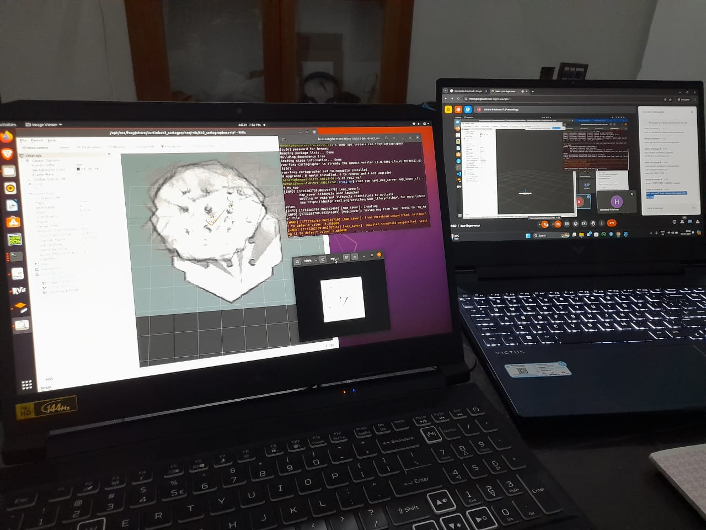
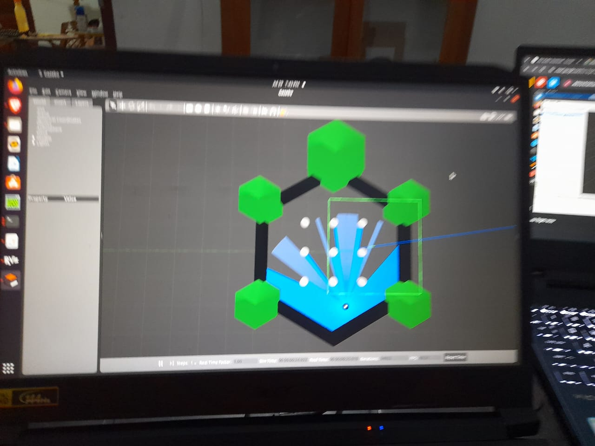

# ROS2 Turtlebot Follower and Turtlebot Navigation

## Overview

This repository contains two ROS2 projects involving Turtlebot robots:

1. **Turtlebot Follower**: A follower robot that tracks and follows a lead robot using TF2 transformations.
2. **Turtlebot Navigation**: A custom mobile robot that autonomously navigates an environment, leveraging both local and global maps.

## Project 1: Turtlebot Follower

### Setup and Execution

1. **Install ROS2 Packages**:
   - Download the required ROS2 packages for Turtlebot from the [ROS official page](https://docs.ros.org/en/foxy/index.html).

2. **Control the Lead Robot**:
   - Use the `teleop_twist_keyboard` to manually control the lead Turtlebot.

3. **Spawn a Follower Robot**:
   - Spawn a second Turtlebot in the simulation environment.

4. **TF2 Communication**:
   - Implement a TF Broadcaster (`broadcaster.py`) on the lead robot to broadcast its position.
   - Implement a TF Listener (`listener.py`) on the follower robot to receive the position data and follow the lead robot.

### Example Commands

```bash
# Launch the lead robot
ros2 service call /spawn turtlesim/srv/Spawn "{x: 2, y: 2, theta: 0.2, name: "turtle2"}"

# Control the lead robot using teleop_twist_keyboard
ros2 run teleop_twist_keyboard teleop_twist_keyboard

# Launch the follower robot
ros2 run follower broadcaster turtle2

# To make the follower listen to turtle1
ros2 run follower listener turtle1 turtle2
```

## Project 2: Turtlebot Navigation

### Setup and Execution

1. **Create a Basic Mobile Robot**:
   - Design the robot using a `.xacro` file, adding components such as IMU and GPS.

2. **Configure the Launch File**:
   - Edit the `.launch` file to set up the robot's parameters and sensors.

3. **Build the Robot**:
   - Use `colcon build` to build the robot.

4. **Launch in Gazebo and RViz**:
   - Launch the robot in Gazebo for simulation and visualize it in RViz.

5. **Odometry and Mapping**:
   - Add odometry to the robot and control it using `teleop_twist_keyboard`.
   - Use Cartographer to create a map of the environment and save it locally.

6. **Autonomous Navigation**:
   - Load the saved map for autonomous navigation.
   - The robot will use both local and global maps to navigate and avoid obstacles.

### Example Commands

```bash
# Build the robot
colcon build

# Launch the robot in Gazebo
ros2 launch my_robot_gazebo my_robot.launch.py

# Control the robot using teleop_twist_keyboard
ros2 run teleop_twist_keyboard teleop_twist_keyboard

# Start Cartographer for mapping
ros2 launch my_robot_navigation cartographer.launch.py

# Start Autonomous Navigation
ros2 launch my_robot_navigation navigation.launch.py
```

## Results

### Turtlebot Follower

The follower robot successfully tracks and follows the lead robot using TF2. Below is a link to the video showing the simulation results:


*Figure 1: Follower Robot Tracking Lead Robot*

### Turtlebot Navigation

The custom mobile robot successfully maps its environment and navigates autonomously, avoiding obstacles. The following images show the simulation results:


*Figure 2: Robot Mapping the Environment*


*Figure 3: Autonomous Navigation in Gazebo*

## Issues Encountered

While the initial implementation was successful, issues were encountered during the replication process. Edits to certain files led to errors, and the final results were not fully re-recorded. However, images of the successful output are attached in the repository.

## Future Work

- Improve error handling and file management.
- Explore advanced navigation techniques and obstacle avoidance algorithms.

## References

For further learning and implementation, you can refer to the following resources:

- [ROS2 Documentation](https://docs.ros.org/en/foxy/index.html)
- [ROS2 Tutorials by Addison](https://automaticaddison.com/tutorials/)
- [Gazebo Simulation](http://gazebosim.org/)
- [TF2 Documentation](https://wiki.ros.org/tf2)
- [Cartographer Documentation](https://google-cartographer-ros.readthedocs.io/en/latest/)

## Special Thanks

Special thanks to **Er. Athira Krishnan R** for her guidance and support throughout this project. Her assistance was invaluable in helping me learn and apply the concepts of ROS2.

Contact: [athirakrishnanr94@gmail.com](mailto:athirakrishnanr94@gmail.com)

## License

This project is licensed under the MIT License - see the [LICENSE](LICENSE) file for details.

---
